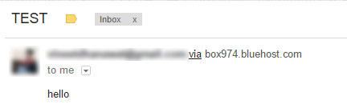

# Email bomber script
Most basic version written in PHP.

## Notes
Using the -f parameter in mail function hides the via server name details

		$additional_parameters = "-f"." ".$emailfrom;
		
That also changes Received-SPF: pass to Received-SPF: softfail

Reference http://stackoverflow.com/questions/8236312/how-to-remove-via-and-server-name-when-sending-mails-with-php

## License

MIT: http://vineetdhanawat.mit-license.org/